# NexusGuard

**Portfolio case study:** [moeijiro.github.io/portfolio/projects/nexusguard](https://moeijiro.github.io/portfolio/projects/nexusguard/) · **Live demo:** not hosted — the app runs locally in a few commands (see below).

**Rule-based security and moderation for Discord servers.** NexusGuard watches member
joins, messages, role changes and manual moderation. It runs them through a
**detection engine**, a **rule engine** and an **action engine**, then acts in Discord and
records every decision for a live web dashboard.

It isn't a `/ban` bot. The slash commands are deliberately few, and the dashboard is where
servers are configured and incidents are reviewed.

> Portfolio project. The public demo runs on **simulated** servers: Nimbus Labs and Pixel
> Forge Community, fictional members, and events generated by a simulator. Simulated data
> is labelled everywhere and never mixes with real servers. Not affiliated with Discord.

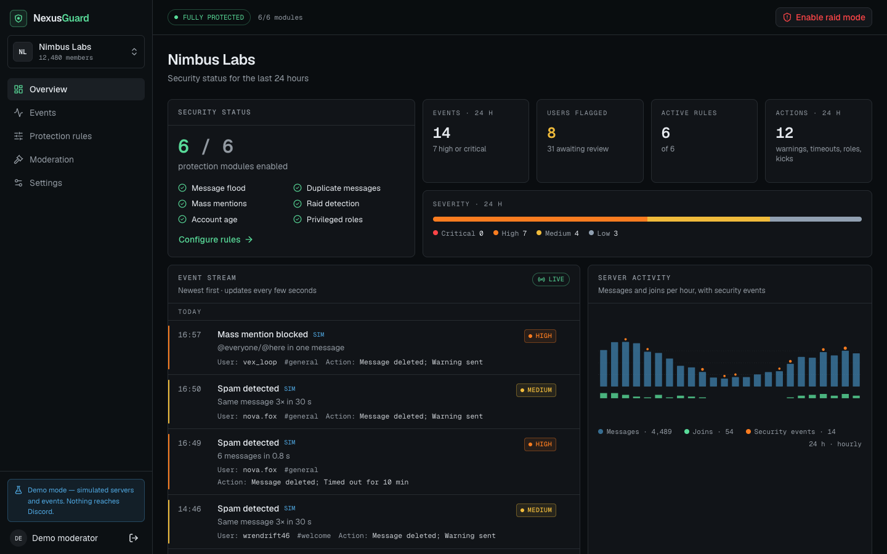

| Event detail: what the engines decided | Raid mode, switched on by a join spike |
| --- | --- |
| 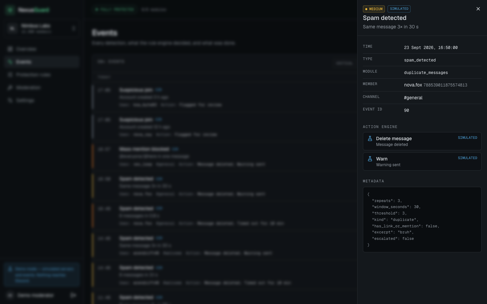 | 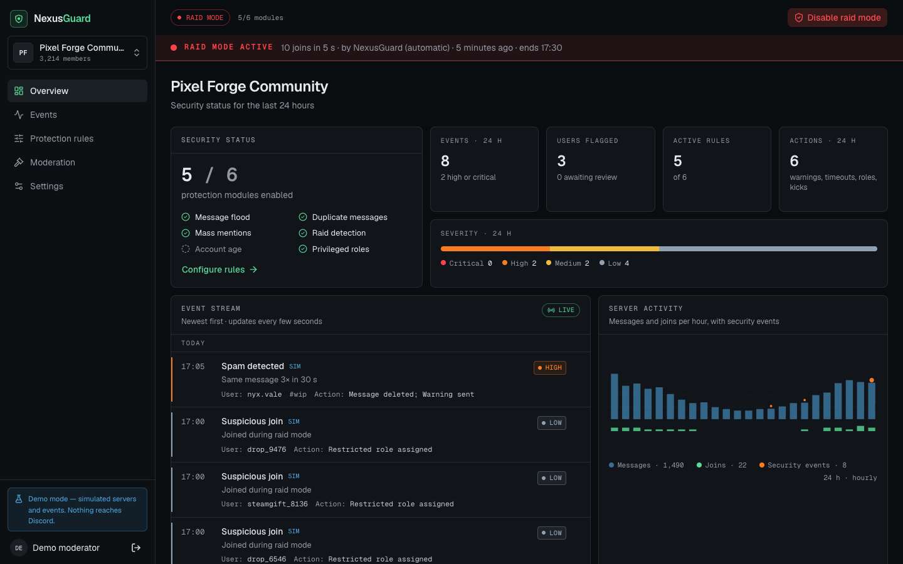 |
| **Protection rules** | **Moderation log** |
| 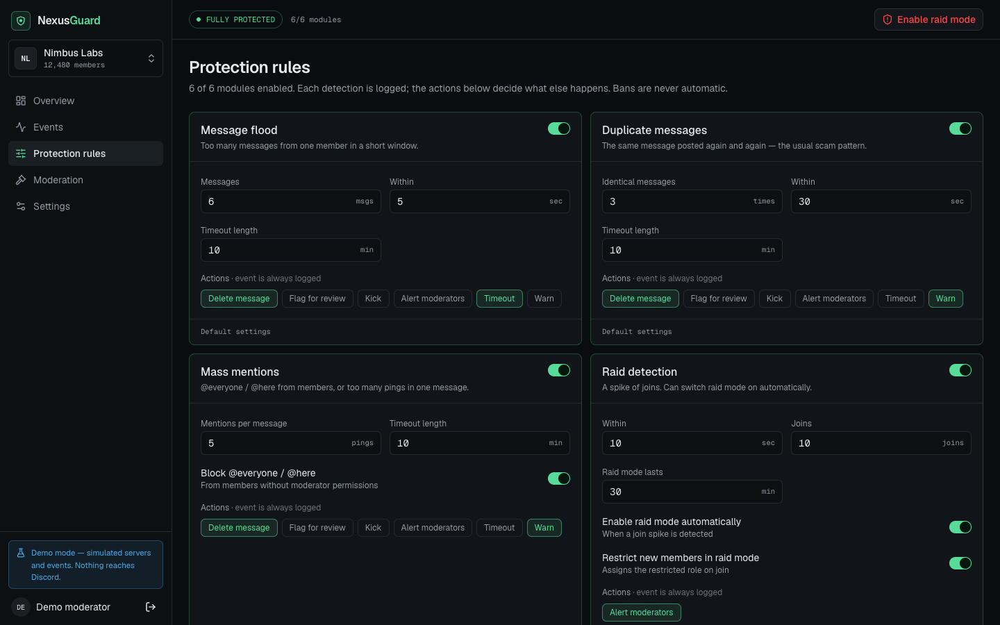 | 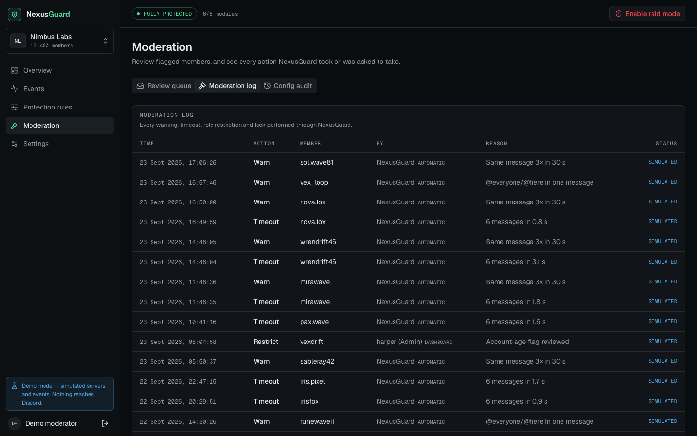 |
| **Settings, permissions and intents** | **Landing page** |
| 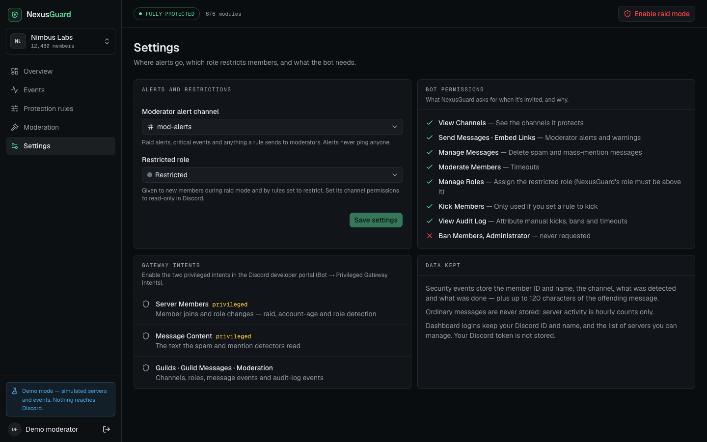 | 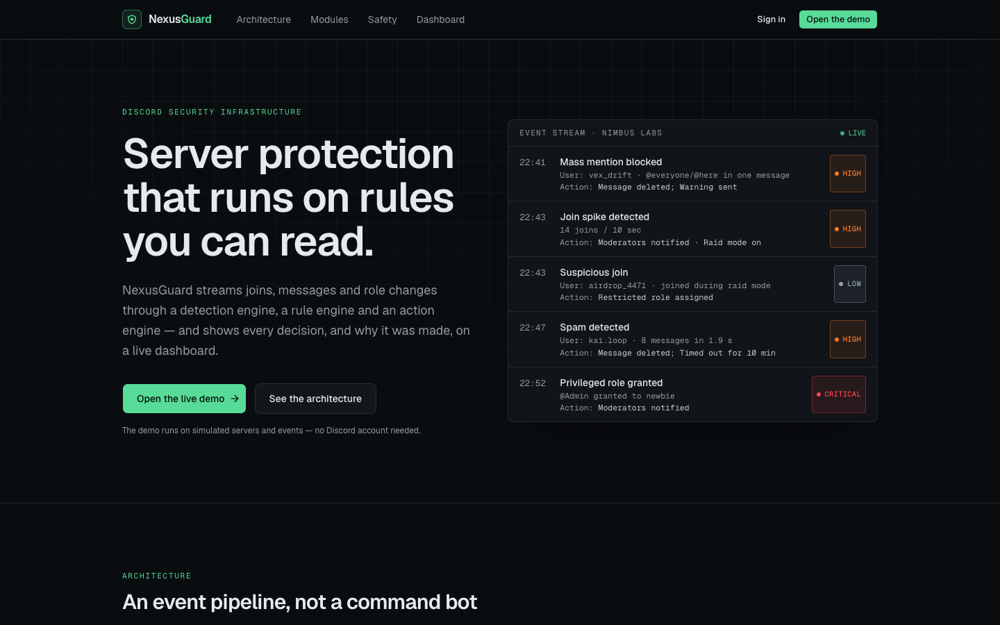 |

<p align="center">
  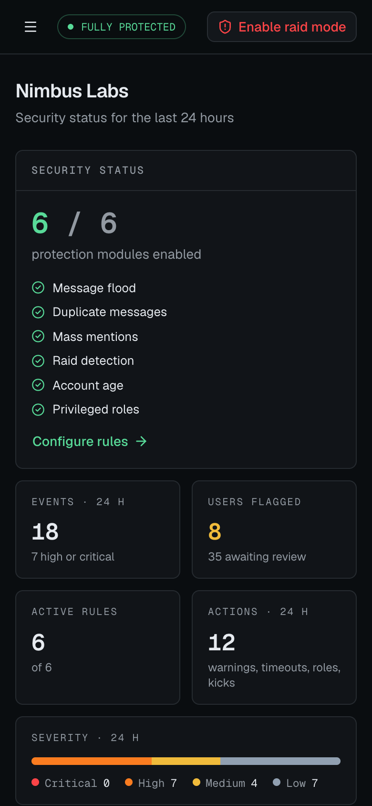
  &nbsp;
  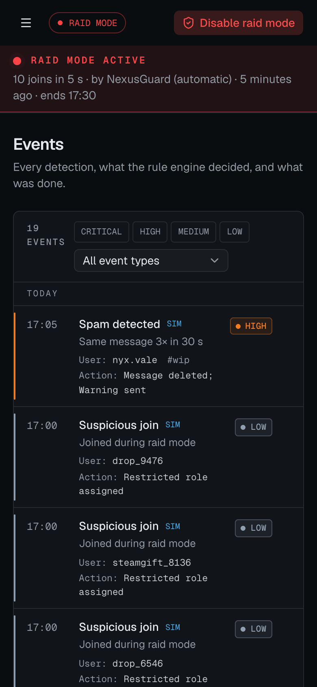
</p>

---

## Contents

- [What it does](#what-it-does)
- [Architecture](#architecture)
- [Detection engine](#detection-engine)
- [Rule engine](#rule-engine)
- [Action engine](#action-engine)
- [Raid mode](#raid-mode)
- [The bot: Discord permissions and intents](#the-bot-discord-permissions-and-intents)
- [OAuth and dashboard permissions](#oauth-and-dashboard-permissions)
- [Dashboard](#dashboard)
- [Demo mode](#demo-mode)
- [API](#api)
- [Setup](#setup)
- [Environment variables](#environment-variables)
- [Testing](#testing)
- [Security limitations](#security-limitations)

## What it does

| Module | Detects | Default actions |
| --- | --- | --- |
| Message flood | One member sending 6 messages within 5 s | delete message, timeout 10 min |
| Duplicate messages | The same message (case- and spacing-insensitive) 3 times within 30 s | delete message, warn |
| Mass mentions | 5+ user or role pings in one message, or `@everyone`/`@here` from a non-moderator | delete message, warn |
| Raid detection | A join spike: 10 joins within 10 s | alert moderators, switch raid mode on for 30 min |
| Account age *(opt-in)* | Accounts younger than 24 h joining | flag for review |
| Privileged roles | A role with Administrator, Manage Server/Roles/Channels/Webhooks, Ban, Kick or Mention Everyone being granted | alert moderators |

Every threshold, action list and timeout length is configurable per server from the
dashboard, within fixed bounds. **Bans are not an action at all.** Kick is available only
on message rules, and never on by default.

## Architecture

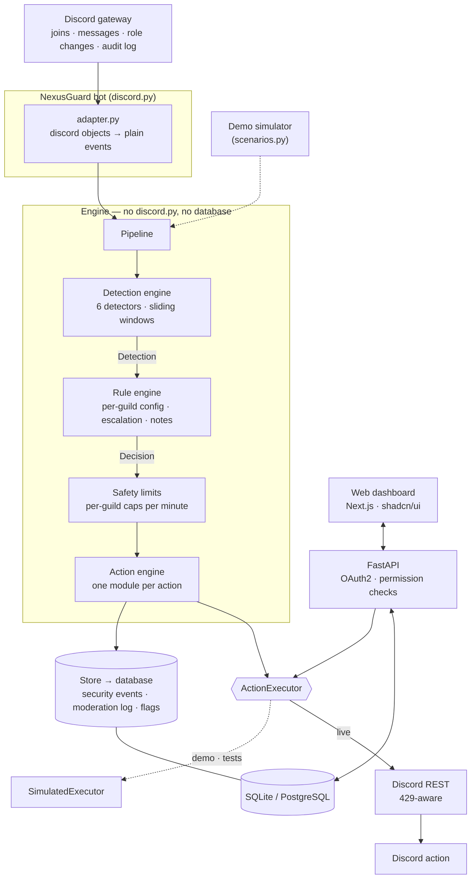

The engine talks to the outside world only through two small protocols in
`engine/ports.py`:

- `ActionExecutor` performs Discord actions. `RestExecutor` sends real REST calls, and
  `SimulatedExecutor` records them for the demo and the tests.
- `Store` reads guild configuration and writes what happened. `SqlStore` is the database
  version.

Because of that split, **the live bot, the demo simulator and the test suite run exactly the
same detection, rule and action code.** Only the edges differ.

```
backend/app/
  engine/
    events.py            normalised events (MessageEvent, MemberJoinEvent, RoleGrantEvent, ModerationEvent)
    detectors/           spam.py · mentions.py · raid.py · account_age.py · roles.py
    rules.py             the rule engine
    rules_schema.py      per-module settings: bounds, allowed actions, defaults
    actions/             delete_message.py · warn.py · timeout.py · restrict.py · kick.py · flag.py · notify.py
    pipeline.py          detectors → rules → safety limits → actions → store
    state.py             sliding windows and cooldowns
    ports.py             ActionExecutor and Store protocols
  bot/                   discord.py client, adapter, guild snapshots, slash commands
  services/              SqlStore, REST/simulated executors, OAuth client, guild service
  api/                   FastAPI routes and the guild-permission dependency
  demo/                  simulated guilds, incident scenarios, seed, live simulator
frontend/                Next.js dashboard (App Router, TypeScript, Tailwind, shadcn/ui)
```

The bot and the API are **two processes sharing one database**. A dashboard edit reaches
the bot within three seconds, which is the lifetime of its guild-config cache. Raid mode
set from `/raidmode` invalidates that cache immediately.

## Detection engine

Each detector gets an event, its module's settings and the short-term `WindowStore`, and
returns a `Detection` or nothing. Detections carry the type, severity, a human summary
(*"7 messages in 1.9 s"*), the member, and metadata.

Severity is **rule-based and documented in each detector's docstring**. No model or score
is involved. Because a detector fires the moment its threshold is reached, severity comes
from *what* the burst looks like, not from how far it overshot:

| Detector | Medium | High | Critical |
| --- | --- | --- | --- |
| Message flood | threshold reached | …within half the window (scripted speed) | — |
| Duplicate messages | threshold reached | …and the message has a link or mention (scam pattern) | — |
| Mass mentions | mention limit reached | 2× the limit, or `@everyone`/`@here` | — |
| Raid | — | threshold reached | the spike doubles during the cooldown (reported once) |
| Account age | younger than 1 hour | — | — |
| Privileged roles | — | any dangerous permission | Administrator |

Account age below the threshold, but older than an hour, is low severity.

Cooldowns turn one burst into **one** event. A 20-account raid produces one "high" alert,
possibly one "critical" escalation, and then silence, not 20 alerts. Moderators, admins and
bots are exempt from the message rules.

## Rule engine

`rules.decide()` turns a detection into a plan, and every adjustment is written into the
event as a **note**. The dashboard can always answer "why did it do that?".

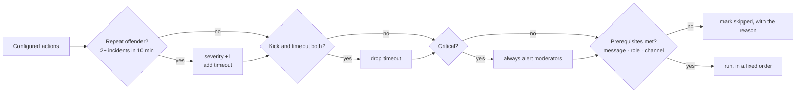

Actions always run in the same order: delete → warn → timeout → restrict → kick → flag →
notify. Notify runs last so the alert can say what was done. A raid detection with
`auto_raid_mode` switches raid mode on for the configured time.

## Action engine

One module per action in `engine/actions/`, each a small `run(ctx)` that calls the executor:

| Action | Discord call | Needs |
| --- | --- | --- |
| Delete message | `DELETE /channels/{c}/messages/{m}` | Manage Messages |
| Warn | DM to the member (closed DMs are logged, not an error) | — |
| Timeout | `PATCH /guilds/{g}/members/{u}` with `communication_disabled_until` | Moderate Members |
| Assign restricted role | `PUT /guilds/{g}/members/{u}/roles/{r}` | Manage Roles, role below the bot |
| Kick | `DELETE /guilds/{g}/members/{u}` | Kick Members |
| Alert moderators | embed in the alert channel, with `allowed_mentions: none` | Send Messages, Embed Links |
| Flag for review | database only | — |

Before any action runs, the pipeline applies **safety limits** per server per minute:
5 kicks, 20 timeouts, 60 role assignments, 30 warnings and 12 alerts. Anything past a cap
is recorded as `suppressed`. A misconfigured rule or a wave of false positives degrades to
"log and tell a human", never to kicking half the server.

Each action result is stored with a status:

- `done`, or `simulated` in the demo
- `skipped`, with the reason (no role, channel or message)
- `suppressed`, when a safety limit was hit
- `failed`, with Discord's reason, for example *"the member is above NexusGuard's role"*

A failure never stops the remaining actions.

The REST executor sends an `X-Audit-Log-Reason`, so Discord's own audit log explains each
action. It honours `429 Retry-After` for up to three attempts.

## Raid mode

- **Automatic:** a join spike switches it on for `raid_mode_minutes`, default 30.
- **Manual:** from the dashboard (the red button in every server's header) or with
  `/raidmode`.
- **While on:**
  - every new member is logged
  - new members get the restricted role, if configured
  - moderators are alerted
  - a banner on every dashboard page shows who enabled it, why, and when it ends
- It **never** kicks or bans the members who joined.

## The bot: Discord permissions and intents

| Permission | Why |
| --- | --- |
| View Channels · Read Message History | see the channels it protects |
| Send Messages · Embed Links | moderator alerts and warnings |
| Manage Messages | delete spam and mass-mention messages |
| Moderate Members | timeouts |
| Manage Roles | assign the restricted role (the bot's role must be above it) |
| Kick Members | only used if a rule is set to kick |
| View Audit Log | attribute manual kicks, bans and timeouts |
| ~~Ban Members, Administrator~~ | never requested |

**Gateway intents:**

- Guilds, Guild Messages and Guild Moderation (audit-log events).
- Two **privileged** intents, which must be enabled in the developer portal under
  Bot → Privileged Gateway Intents:
  - **Server Members**, for joins and role changes
  - **Message Content**, for the text the spam and mention detectors read

**Slash commands:** only four, since the dashboard is the management interface.

| Command | Who | Does |
| --- | --- | --- |
| `/security` | Manage Server | modules enabled, raid mode, last 24 h |
| `/incidents [count]` | Manage Server | the latest events |
| `/raidmode <on/off> [minutes]` | Manage Server | toggles raid mode (audited) |
| `/warn <member> <reason>` | Moderate Members | DMs a warning and writes the moderation log |

The bot also keeps a snapshot of each server's channels and roles in the database. Each
role is marked *assignable* if it sits below the bot's highest role, so the dashboard's
pickers never call Discord.

## OAuth and dashboard permissions

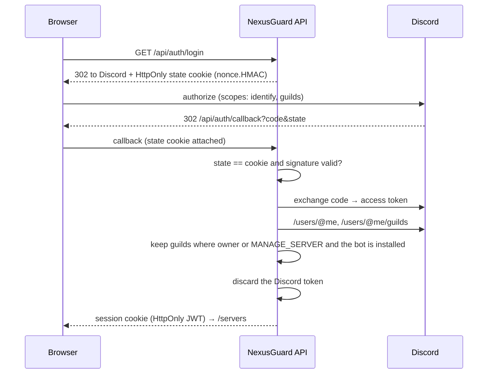

- **Scopes:** `identify guilds` only. NexusGuard never acts as you.
- **The token is not stored.** It is used for the two calls above and discarded. What's kept
  is a **permission snapshot**, one `GuildAccess` row per server you can manage. Each guild
  route checks that snapshot.
- **Management requires** being the server owner, or holding Manage Server (Administrator
  implies it), exactly as Discord computes it.
- **The snapshot expires.** After `GUILD_ACCESS_TTL_MINUTES` the API asks you to sign in
  again, so lost permissions stop working without needing a stored token. Each login also
  rebuilds the snapshot from scratch.
- **Unrelated servers are a 404.** That covers servers you can't manage, servers without the
  bot, and servers that don't exist, so the existence of other servers is never revealed.
- **Demo and real sessions are separate worlds.** A demo session sees only simulated
  servers, and a Discord session never sees them.

## Dashboard

- **Overview:**
  - factual protection status: *"5 of 6 protection modules enabled"*, with no invented
    security score
  - events, flagged users, active rules and actions in the last 24 h
  - a severity breakdown
  - a **live event stream**, polled every 4 s by `after_id`, deduplicated and newest first
  - hourly server activity (messages, joins, events)
- **Events:** the full log with severity and type filters and cursor pagination. Each event
  opens a detail sheet with:
  - the action engine's results and their statuses
  - the rule engine's notes
  - the raw metadata
- **Protection rules:** one card per module with an enable switch, bounded numeric
  settings, feature switches and action chips. The chips are limited to what that module
  allows. Cards warn when a prerequisite is missing, and every save is written to the audit
  trail.
- **Moderation:**
  - the review queue: dismiss, time out, restrict or kick a flagged member
  - the moderation log: automatic, dashboard and slash-command actions
  - the configuration audit trail: who changed which rule, setting or raid mode
- **Settings:**
  - the alert channel and the restricted role (roles above the bot are disabled)
  - the permission list with a re-invite link
  - the intents, and what data is kept

## Demo mode

`python -m app.demo.seed` builds two simulated servers by playing a week of incident
scenarios through the **real pipeline**, with the simulated executor:

- floods
- link-spam repeats
- `@everyone` attempts
- mention spam
- new accounts
- a raid
- an admin-role grant
- manual kicks

With `DEMO_SIMULATOR_INTERVAL > 0`, the API keeps generating new incidents so the event
stream moves while you watch. One demo server is currently in raid mode, so that state is
visible.

The demo is shared: anyone with the demo login can change rules or toggle raid mode.
Reseed to reset it.

## API

JSON over HTTP with an HttpOnly session cookie. Errors are always
`{"error": {"code", "message"}}`. OpenAPI docs are at `/docs`.

| Area | Endpoints |
| --- | --- |
| Auth | `GET /api/auth/mode` · `GET /api/auth/login` · `GET /api/auth/callback` · `POST /api/auth/demo` · `POST /api/auth/logout` · `GET /api/me` |
| Guilds | `GET /api/guilds` · `GET /api/guilds/{id}` · `GET …/overview` · `GET …/resources` |
| Configuration | `PATCH …/settings` · `GET …/rules` · `PUT …/rules/{module}` |
| Raid mode | `POST …/raid-mode` |
| Security events | `GET …/events?severity=&type=&after_id=&before_id=` · `GET …/events/{id}` |
| Moderation | `GET …/moderation` · `GET …/flags` · `POST …/flags/{id}/resolve` · `GET …/audit` |
| System | `GET /api/health` |

Mutating routes are rate-limited per user, and login per IP. Rule bodies are validated by
the module's own Pydantic schema: unknown fields, out-of-range numbers and disallowed
actions such as `ban` return a 422 naming the field.

## Setup

Requirements: Python 3.12+ and Node 20+.

```bash
make install
cp .env.example backend/.env
cp frontend/.env.example frontend/.env.local
make seed        # simulated demo servers
make api         # http://localhost:8000  (runs the demo simulator)
make web         # http://localhost:3000  → "Explore the demo"
```

**Protecting a real server:**

1. Create an application at <https://discord.com/developers/applications>.
2. Under **Bot**: copy the token into `DISCORD_BOT_TOKEN`, and enable the **Server Members**
   and **Message Content** intents.
3. Under **OAuth2**: copy the client ID and secret, and add the redirect
   `http://localhost:8000/api/auth/callback`.
4. Restart the API, then run `make bot`.
5. Invite the bot. The dashboard's "Add NexusGuard" link requests exactly the permissions
   listed above.
6. Move NexusGuard's role above the restricted role. Create that role if you use raid-mode
   restrictions, and set its channel permissions to read-only.
7. Sign in with Discord.

## Environment variables

| Variable | Default | Meaning |
| --- | --- | --- |
| `ENVIRONMENT` | `development` | `production` refuses a weak `SECRET_KEY` or insecure cookies |
| `APP_URL` / `API_URL` | `:3000` / `:8000` | CORS origin and OAuth redirect base |
| `DATABASE_URL` | `sqlite:///./nexusguard.db` | Shared by the API and the bot. PostgreSQL: `postgresql+psycopg://…` |
| `SECRET_KEY` | dev value | Signs sessions and the OAuth state |
| `SESSION_TTL_MINUTES` | `720` | Dashboard session lifetime |
| `COOKIE_SECURE` / `COOKIE_SAMESITE` | `false` / `lax` | Cookie flags |
| `DISCORD_CLIENT_ID` / `DISCORD_CLIENT_SECRET` | — | OAuth2 login. Leave empty for demo-only |
| `DISCORD_BOT_TOKEN` | — | Bot login and REST actions |
| `GUILD_ACCESS_TTL_MINUTES` | `720` | How long a login's permission snapshot is trusted |
| `DEMO_ENABLED` | `true` | Offer "Explore the demo" |
| `DEMO_SIMULATOR_INTERVAL` | `25` | Seconds between simulated incidents (0 = off) |

## Testing

```bash
make test        # 69 tests, fresh SQLite per test, no network
```

- **Detection:**
  - flood thresholds, including one event per burst, slow bursts and configurable limits
  - duplicate and link spam
  - `@everyone` and mention limits
  - moderator and bot exemptions
  - join spikes versus normal join traffic, and raid escalation
  - opt-in account age that only ever flags
  - admin role grants
- **Rules and actions:**
  - a disabled module never runs or acts, and disabling one leaves the others running
  - action order, repeat-offender escalation, kick superseding timeout
  - skipped prerequisites, and critical events always alerting
  - no module can ban, and defaults never kick
  - the kick safety cap
  - a Discord failure is recorded rather than raised
- **Event storage:** events record guild, user, type, severity, timestamp, metadata and
  action taken. Moderation-log rows and review flags are written.
- **Guild permissions and OAuth:**
  - login redirect scopes, and forged state rejected
  - the snapshot holds only manageable, installed servers, and the Discord token is stored
    nowhere
  - other servers return 404, and a stale snapshot asks for a fresh login
  - a new login drops lost servers, and demo sessions see only simulated servers
- **Config persistence:** rule validation, persistence and audit, and settings that only
  accept the server's own channels and assignable roles.
- **Raid mode and review queue:** the toggle and its alert, flag resolution happening once,
  and the stream's `after_id` polling.
- **Bot adapter** (stand-in discord.py objects): event mapping, `@everyone` attempt
  detection, moderator recognition, role-grant diffs, audit-log attribution.
- **REST executor** (mock transport): the exact Discord calls and headers, alerts that
  never ping, 429 retry and give-up, permission errors, closed DMs.

CI (GitHub Actions) runs the tests, and lints and builds the dashboard.

**What was not verified:**

- The bot was never connected to Discord: no bot token was available while building. Its
  Discord-facing code is covered only through the adapter and executor tests above.
- OAuth2 is covered only against a mocked Discord.
- Everything else was checked by running the API, the demo simulator and the dashboard in a
  browser.

## Security limitations

- **Heuristics, not certainty.** Rate, repeat and mention thresholds catch common abuse
  patterns. A careful spammer who stays under them won't be caught, and busy legitimate
  moments (a launch announcement, a meme wave) can trip them. That's why defaults delete
  and time out rather than kick, and why every event can be reviewed.
- **No content analysis.** There is no AI moderation, link reputation or image scanning.
  Duplicate detection compares normalised text only.
- **In-memory windows.** Detector windows and safety caps live in the bot process. A restart
  forgets at most one window of history, and running several bot shards would need a
  shared store such as Redis.
- **The permission snapshot is only as fresh as its TTL.** Losing Manage Server in Discord
  takes effect in the dashboard at the next login, or at expiry at the latest.
- **Role hierarchy.** Discord won't let the bot act on members whose highest role is above
  its own. Those actions are recorded as `failed` with that reason.
- **Rate limits.** The executor retries 429s briefly. A server-wide raid still hits
  Discord's own limits, which is part of why raid mode restricts rather than kicks.
- **Shared demo.** Demo users all share the same simulated servers.

## Deployment

There is no hosted instance; the project is set up to deploy as separate processes:

- **API:** `uvicorn app.main:app --host 0.0.0.0 --port 8000` with `ENVIRONMENT=production`. The app refuses to start in production if `SECRET_KEY` is weak or `COOKIE_SECURE` is false.
- **Web:** `cd frontend && npm ci && npm run build && npm start`, with `NEXT_PUBLIC_API_URL` pointing at the API.
- **Bot:** `python -m app.bot` with `DISCORD_BOT_TOKEN` is a separate process sharing the database with the API. Set `DEMO_ENABLED=false` for a real server.
- **Database:** `DATABASE_URL` takes any SQLAlchemy URL. The project is developed and tested on SQLite.
- **Cookies:** serve the web app and the API from the same site (for example `app.example.com` and `api.example.com`) so the SameSite session cookie is sent, and set `COOKIE_SECURE=true` behind HTTPS.

## License

MIT © Moeijiro
